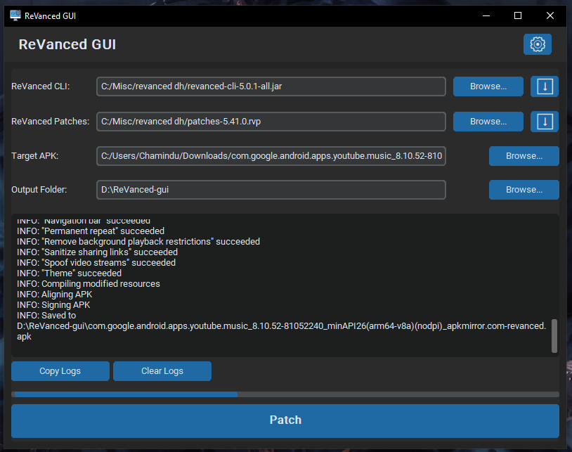

# ReVanced GUI (Python)

[](https://www.python.org/) 
[](LICENSE)
[](https://github.com/chamindudilsh/revanced-gui/actions/workflows/build.yml)
[](https://github.com/chamindudilsh/revanced-gui/releases)

**Graphical User Interface for ReVanced CLI – Easily patch apps without touching the terminal!**
---


## ⚠️ Disclaimer

This project is **not affiliated with ReVanced**.  
This is a personal project created for convenience and educational purposes only.

---
## ⚡ Features

- Easy-to-use GUI for ReVanced CLI  
- No need to run terminal commands  
- Cross-platform cuz Python (Windows/Linux/macOS)

## 🤝 Requirements

- Java Runtime Environment 11 ([Azul Zulu JRE](https://www.azul.com/downloads/?version=java-11-lts&package=jre#zulu) or [OpenJDK](https://jdk.java.net/archive/))
- Python 3 ([Download](https://www.python.org/downloads/))
> [!NOTE]
> Python is only required if you are running ```revanced-gui.py``` directly.

---

## ⚡ Quick Start (Windows)
1. Download the latest `.exe` from [Releases](https://github.com/chamindudilsh/revanced-gui/releases)
2. Double-click to run the GUI
3. Follow the on-screen instructions.

## 💻 Installation (Running from source)

1. Clone the repository:  
```bash
git clone https://github.com/chamindudilsh/revanced-gui.git
```

2. Navigate to the project folder:
```bash
cd revanced-gui
```

3. Install dependencies:
```bash
pip install -r requirements.txt
```

## 🚀 Usage

1. Run the GUI:
```bash
python revanced-gui.py
```

2. Follow the on-screen instructions to patch your apps easily.

## 🤝 Contributing
Contributions are welcome! Fork the repository, make your changes, and open a Pull Request.

## 📄 License
This project is licensed under the GPLv3 license. Please see the [license file](LICENSE) for more information.
